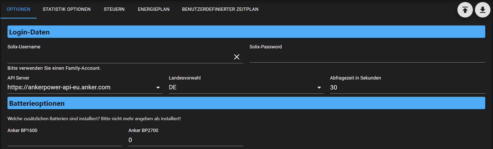
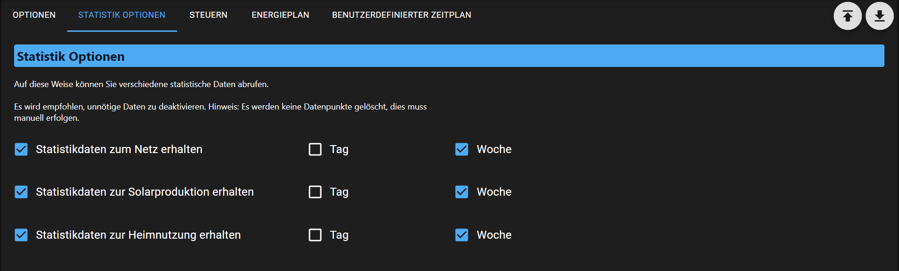
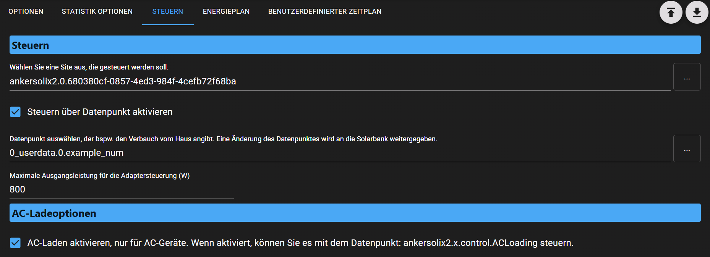
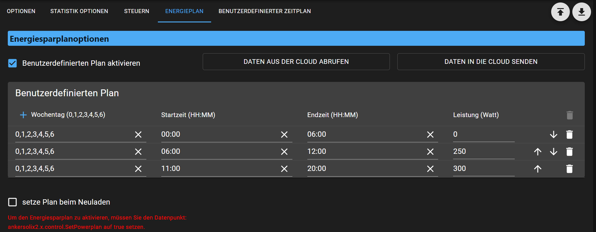

## 📑 Inhaltsverzeichnis

- [Überblick AdminUI](#AdminUi)
- [Funktionen](#funktionen)
- [Datenpunkte](#datenpunkte)

---

## AdminUI

Überblick über die Funktionen die im AdminUI zur Verfügung stehen.

### Optionen

- Logindaten
    - Logindaten für den Account eingeben.
      Seit Ende Juli 2025 kann hier auch der Admin Account verwendet werden,
      da sich die unterschiedlichen Geräte den Token nicht mehr wegziehen.
    - Beim Verwendeten Server muss der Server und der Ländercode gegeben werden,
      wo der Account erstellt wurden ist. Anderenfall kommt es zu Fehlermeldungen beim Login.
- Battieroptione
    - Da man auch der Anker Cloud nicht direkt auslesen kann, welche Batterietyp verwendet wird (nur die Anzahl).
      Kann man hiermit eingeben wieviel an vom welchem Typ verbaut hat.
      Die Angabe ist massgebend für die Berechnung der Gesamt Energie im Akku (Datenpunkt: battery_energy der jeweiligen Solarbank)

### Statistik

Hier ist auswählbar welche Statistikdaten aus der Cloud ausgelesen werden und wie sie dargestellt werden.
Nicht benötigte Daten bitte abwählen, da dies die Anfragehäufigkeit reduziert.

### Steuern

- Bei der zu steuernden Site wir die Solarbank angegeben die gesteuert werden soll.
  Hier wird nur die Site-ID ausgewählt und nicht die Solarbank an sich.K
  Keine Sorge sollte man die Solarbank ausgewählt haben wird trotzen nur die Site-ID verwendet.  

- Steuern über einen selbstgewählten Datenpunkt, diese ist freiwählbar und ist er eingestellt überwacht der Adapter den Datenpunkt auf Änderung.
  Ändert sich der Wert, stell der Adapter die Solarbank auf den benutzerdefinierten Modus ein mit 24/7 und den Powerwert aus dem Datenpunkt.
  Über die Option "Maximale Ausgangsleistung für die Adaptersteuerung (W)" kann dieser Wert zusätzlich begrenzt werden.  

- Ist der Wert im Datenpunkt höher als das eingestellte Limit, wird nur der begrenzte Wert an die Anker Cloud übertragen.  

  Vorsicht: alle selbst eingestellen benutzdefinierten Zeilpläne werde überschrieben, Abhilfe wird im Punkt Energieplan beschrieben.

### Energieplan

- Genau wie in der Anker App auch, kann man hier einen Zeitplan einstellen bzw. auch den vorhanden aus der Cloud auslesen und auch wieder schreiben.
- Ist die aktiviert kann man über den Datenpunkt: ankersolix2.x.control.SetPowerplan den Zeitplan extern wieder auf aktiv setzen.
- Die Option setze beim Neulanden bewirkt, dass der eingestellt paln nach dem Neustart des Adapters automatisch gesetzt wird.

### Benutzerdefinierter Zeitplan

- Hier besteht die Möglichkeit, dass der Adapter nach der angegeben Zeit die Betriebsmodis der Solarbank umschaltet.

## Funktionen

- Auslesen der Anker Cloud und gelesen Werte (ohne Filterung) in Datenpunkten darstellen
- Auslesen von Statistikwerten aus Anker Cloud
- Einstellung Zeitplan mit Umschaltung der Betriebmodis
- Energieplan bearbeiten analog zur App

## Datenpunkte

### ankersolix2.0.\<Site-ID\>

| Name          | Beschreibung                                                                                                                                     |
| ------------- | ------------------------------------------------------------------------------------------------------------------------------------------------ |
| `\<Site-ID\>` | Unter der Site-ID werden alle Daten zum ausgelesenen System dargestellt, alle Werte sind Readonly und können nicht zum Steuern verwendet werden. |

### ankersolix2.0.control.\*

| Name           | Beschreibung                                                                                                                                                          |
| -------------- | --------------------------------------------------------------------------------------------------------------------------------------------------------------------- |
| `ACLoading`    | Hiermit könnten AC Geräte durch externe Script zum Laden über Netzstorm bewegt werden. Die Zeit ist fest eingestellt, nach dem Setzen auf True sind es von jetzt +12h |
| `SetPowerplan` | Setzt den im AdminUI eingestellen Powerplan erneut.                                                                                                                   |

---
