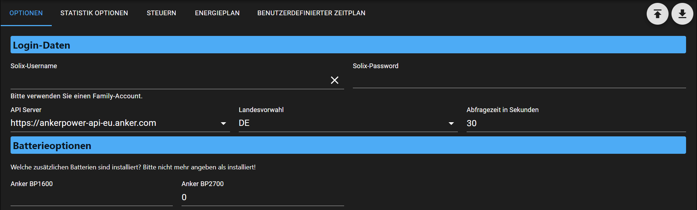
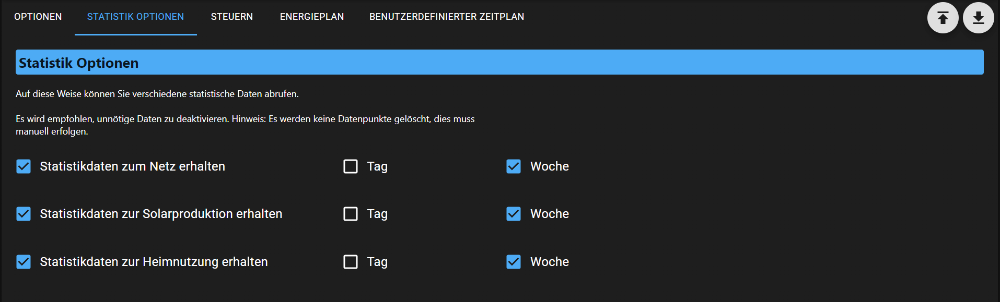
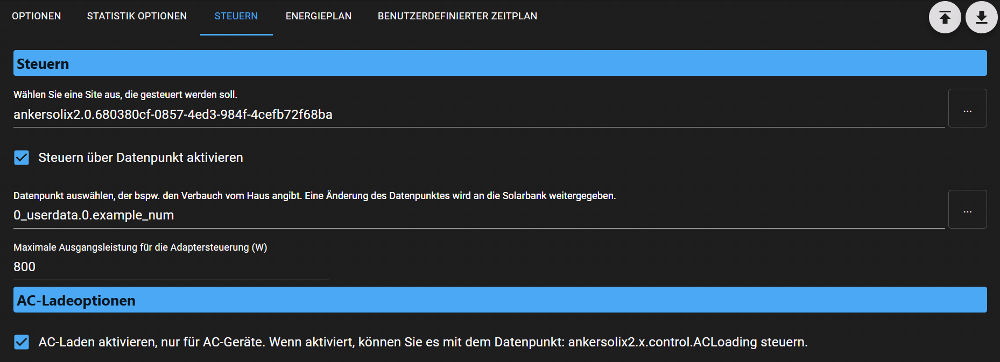
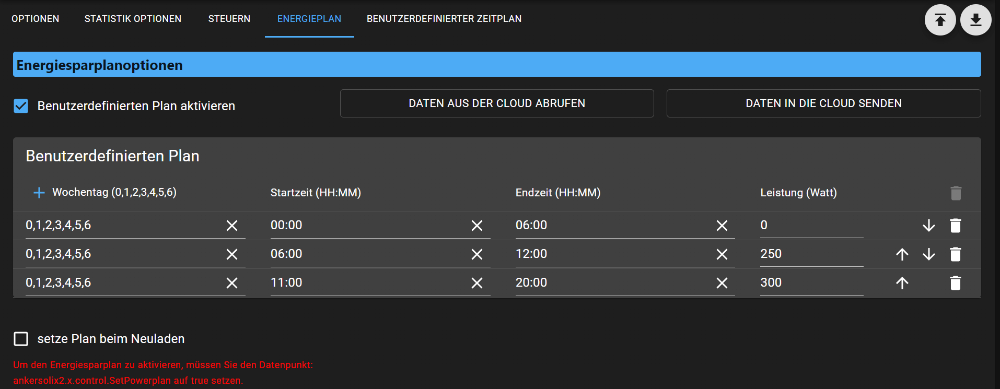

## 📑 Table of Contents

- [AdminUI Overview](#adminui)
- [Features](#features)
- [Data Points](#data-points)

---

## AdminUI

Overview of the functions available in the AdminUI.

### Options

- Login Credentials
    - Enter the login credentials for your account.  
      Since the end of July 2025, the Admin account can also be used,  
      as different devices no longer interfere with each other's tokens.
    - The selected server must include both the server address and the country code  
      where the account was originally created. Otherwise, login errors may occur.

- Battery Options
    - Since the Anker Cloud does not directly provide battery type information (only quantity),  
      you can manually specify how many batteries of each type are installed.  
      This input is essential for calculating the total energy stored in the battery  
      (data point: `battery_energy` of the respective Solarbank).

### Statistics

Here you can select which statistical data is retrieved from the cloud and how it is displayed.  
Please deselect any unnecessary data to reduce the frequency of requests.

### Control

- For the site to be controlled, the Solarbank is specified.  
  Only the Site ID is selected here, not the Solarbank itself.  
  No worries—if you select the Solarbank, only the Site ID will be used anyway.

- Control via a custom data point: this is freely selectable.  
  If configured, the adapter monitors the data point for changes.  
  When the value changes, the adapter sets the Solarbank to custom mode with 24/7 operation  
  and uses the power value from the data point.  
  Warning: All manually configured custom schedules will be overwritten.  
  See the section "Energy Plan" for a workaround.

### Energy Plan

- Just like in the Anker app, you can set a schedule here,  
  or read the existing one from the cloud and write it back.
- If enabled, you can externally reactivate the schedule via the data point:  
  `ankersolix2.x.control.SetPowerplan`
- The option "Set on reload" ensures that the configured plan is automatically applied  
  after the adapter restarts.

### Custom Schedule

- This allows the adapter to switch the operating mode of the Solarbank  
  after a specified time.

---

## Features

- Read data from the Anker Cloud and display it in data points (unfiltered)
- Retrieve statistical values from the Anker Cloud
- Configure schedules with automatic mode switching
- Edit energy plans similar to the official app

---

## Data Points

### ankersolix2.0.\<Site-ID\>

| Name          | Description                                                                                                                                 |
| ------------- | ------------------------------------------------------------------------------------------------------------------------------------------- |
| `\<Site-ID\>` | Under the Site ID, all data related to the retrieved system is displayed. All values are read-only and cannot be used for control purposes. |

### ankersolix2.0.control.\*

| Name           | Description                                                                                                                               |
| -------------- | ----------------------------------------------------------------------------------------------------------------------------------------- |
| `ACLoading`    | Allows external scripts to trigger AC device charging via grid power. The duration is fixed: 12 hours from the moment it's set to `true`. |
| `SetPowerplan` | Re-applies the power plan configured in the AdminUI.                                                                                      |

---
